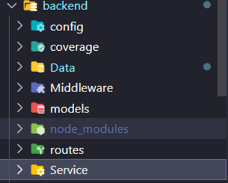
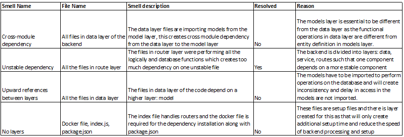
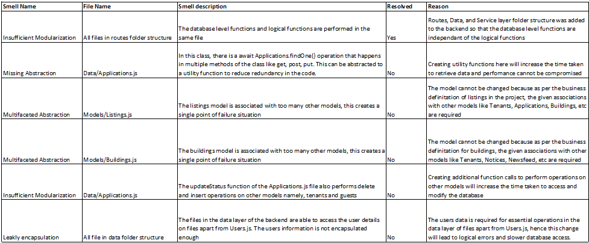
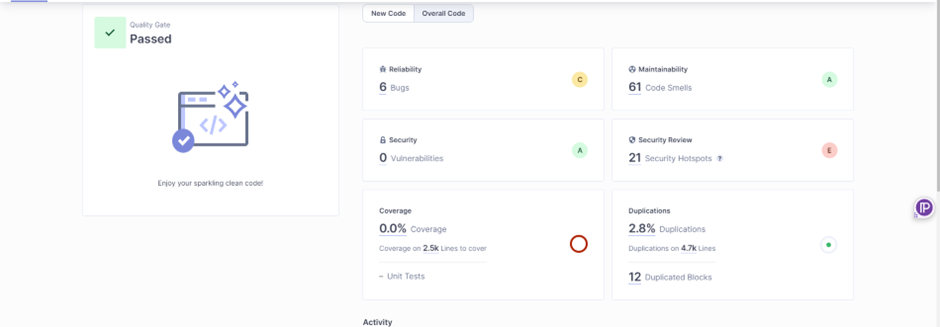
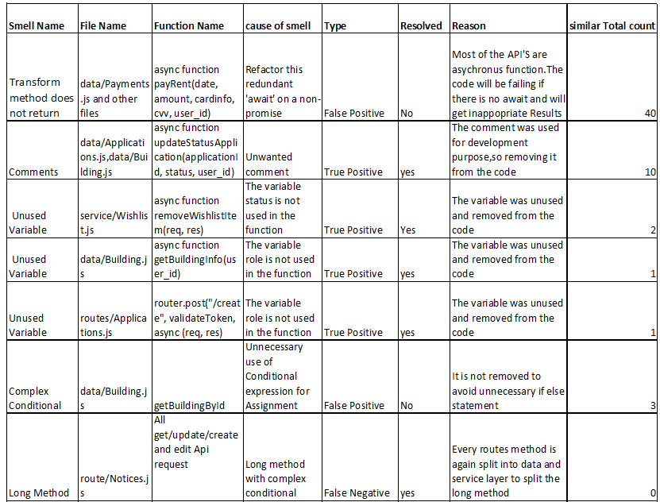
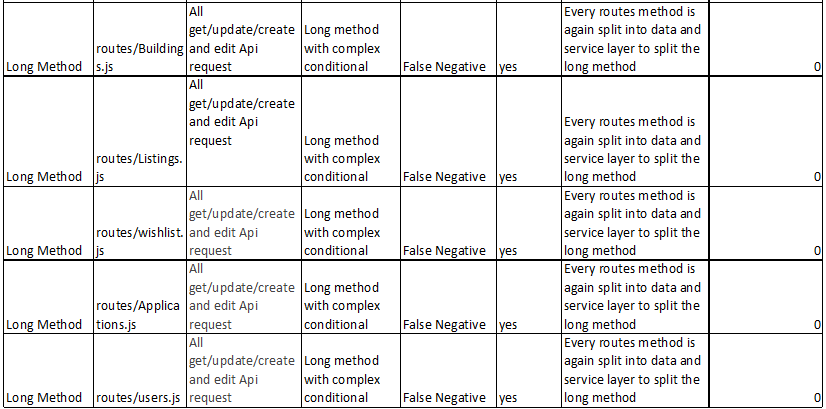

# Design Principles
## Single Responsibility Principle
1. Each module on our Node.js project has a single responsibility. In SRP, one module will perform only one job. For example: A module for handling authentication: Backend/middleware Folder<br/>
2. Separate modules for: <br/>
a. Routing layer – For routing the paths of the backend calls: backend/routes <br/>
b. Service layer – For connecting the router and data layer:  backend/service <br/>
c. Data layer – For interacting with the database and data logic: backend/data <br/>



## Open Closed Principle
1. In the code, we use a plugin or middleware system that allows extending functionality without modifying core code. For example: Implement a middleware system to add additional processing to HTTP requests. Use event-driven architecture to allow extensions through event listeners. <br/>
2. For Example: <br/>
const { verify } = require("jsonwebtoken");

```const validateToken = (req, res, next) => {
  const accessToken = req.header("accessToken");

  if (!accessToken) return res.json({ error: "User not logged in!" });

  try {
    const validToken = verify(accessToken, "important secret");
    req.user = validToken;
    if (validToken) {
      return next();
    }
  } catch (err) {
    return res.json({ error: err });
  }
 };
```

This is then called using:

```router.get("/",validateToken, async (req, res) => { ```

## Liskov Substitution Principle (LSP)
1. Role-Based Access Control:
The routes seem to be designed based on the role of the user (Manager, etc.), and each route checks whether the user has the appropriate role before proceeding. This aligns with the idea that different roles can substitute for each other in the context of building-related operations, this eases substitution. <br/>
2. Service Layer Abstraction:
We've abstracted away the actual business logic to a service layer (service/Buildings.js). This is a good practice as it allows for easier testing and maintenance. Each route delegates the actual work to this service layer. <br/>
3. Consistent Response Structure:
The responses from different routes seem to follow a consistent structure with properties like success, message, data, and error. This consistency can make it easier for clients to consume the API. <br/>
4. Middleware Usage (validateToken):
The use of middleware (validateToken) to validate user tokens before processing requests is a good security practice. It ensures that only authenticated users can access certain routes. <br/>

## Interface segregation principle
Without the explicit definition of interfaces (as in languages like Java or TypeScript), adherence to ISP in JavaScript/Node.js often relies on good modular design and avoiding unnecessary dependencies between modules. Here, we followed ISP in the following way: <br/>
1. Role-based routes:
Routes are organized based on the role of the user (Manager or others). Each route seems to handle specific functionality related to the role. Routes are designed to cater to the specific needs of different roles. For example, a Manager has different actions compared to other roles. <br/>
2. Service Layer Abstraction:
The service layer (service/Listings.js) encapsulates the business logic related to listings. Each route delegates its work to this service layer. <br/>
3. Optional Routes for Certain Roles:
Some routes are specific to certain roles, like the /getBuildingInfo route, which seems to be designed for a specific use case (here tenant-related). <br/>

## Dependency Inversion Principle
Dependency Inversion typically involves dependencies from the outside rather than creating them within the module. A high-level module should not depend on a low-level module, they should rather depend on the abstractions. In our code we are not explicitly injecting dependencies, it follows a common pattern where dependencies are imported at the top of the file. In this case, the service module is serving as a dependency for handling listing-related operations and similarly for the data service.<br/>

# Cohesion and coupling
Code exhibits good cohesion within the modules, focusing on different related operations. Only a reasonable level of coupling with the modules, that seems appropriate for handling the data logic. Overall, the balance between cohesion and coupling appears to be reasonable in our code. <br/>

# Architecture Smells


# Design Smells


# Implementation Smells
Since our code is a JavaScript project, we used SonarQube for analysing and detecting implementation smells in the code. The detailed view of smells that were detected in SonarQube before refactoring is as follows: <br/>
<br/>
Out of 61 code smells,40 code smells are false positives which are the same issue on await the asynchronous call.
The other smells in SonarQube are resolved. This is the final scan report after running again: <br/>
<br/>
A detailed view of the Implementation smell and the refactoring can be seen below.<br/>
 <br/>
 <br/>

# Other clean code practices
1.	Error Handling: <br/>
The code includes error handling for different scenarios, such as when a user doesn't have the required permissions or when there's an internal server error. Proper error handling is crucial for maintaining the stability of the application. <br/>
2.	Small methods: <br/>
Our methods are reasonably small and focused on specific functionalities, we divided our codebase into different folders such as middleware, routes, service, config and data layer. Each method has a maximum line of 20-25 lines and we put every code in try-catch to handle the exceptions. And validated different user case scenarios. <br/>
3.	Comments explaining rationale <br/>

```
 /**
 * Route to insert a new listing for a manager.
 * @name POST/
 * @function
 * @memberof module:Routes/Listings
 * @inner
 * @param {string} path - Express route path ("/").
 * @param {function} middleware - Middleware function to validate the user's token.
 * @param {function} callback - Express route callback.
 *
router.post("/", validateToken, async (req, res) => {
  try {
    // Extract listing, user_id, role, and buildingName from the request body
    const listing = req.body;
    const user_id = req.user.id;
    const role = req.user.role;
    const buildingName = req.body.buildingName;

    // Call the service layer to create a new listing 
    const result = await service.createListing(listing, user_id, role, buildingName);
    // Check if the listing is created successfully or if there's an error 
    if (result) {
      res.json({ success: true, message: "Created successfully" });
    } else {
      res.status(500).json({ success: false, error: "User doesn't have the permission or an error occurred" });
    }
  } catch (error) {
    console.error("Error in / route:", error);
    res.status(500).json({ success: false, error: "Internal server error" });
  }
  ```
  
<br/>
We followed JSDocs for commenting the code,as seen in the last code ,we followed the specific format for format and each comment explain what it does in a particular context. <br/><br/>
4.	Double Negatives in conditions <br/>
we don’t have any instances of double negatives in the conditions. The conditions in our code seem straightforward and don't involve confusing negations or double negatives.see the code below,this code is clear and doesn’t have any confusing negations. <br/>
```
if (manager) { 
        const building = await buildings.findOne({ where: { id: buildingId, managerId: manager.id } });
        return building ? building : null; 
      } else { 
        return null; // Manager not found
      }
```
<br/>


